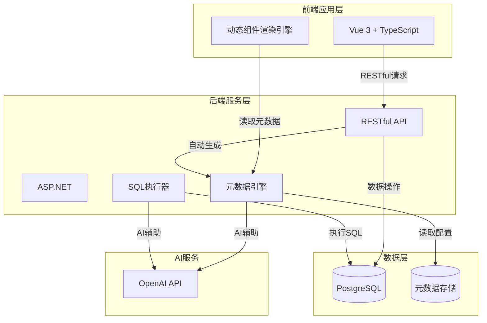
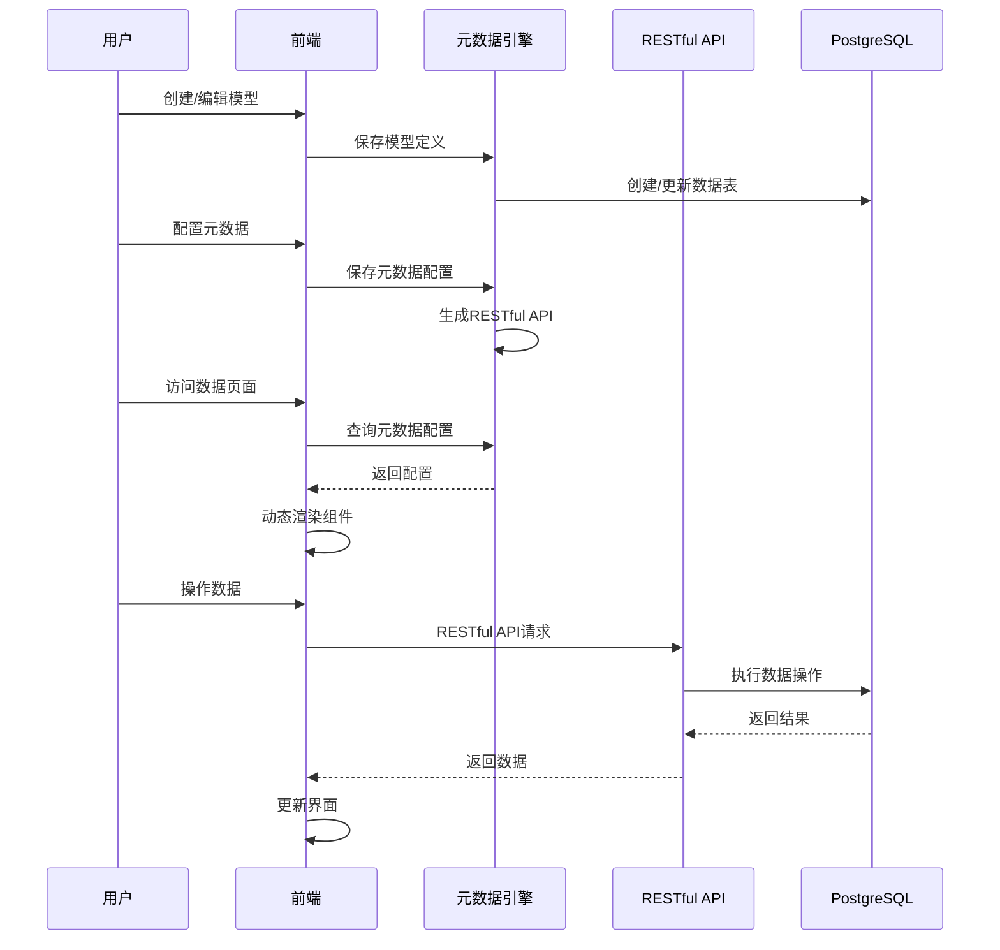
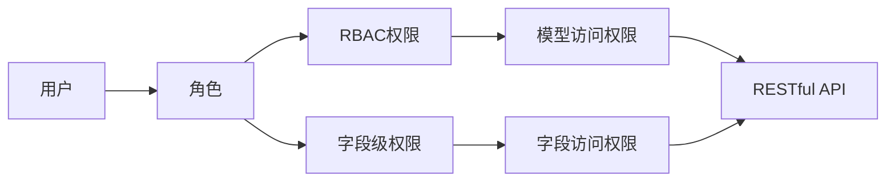

# 系统架构

## 架构图

## 架构说明

### 前端应用层

- **Vue 3 + TypeScript**：提供用户界面和交互
- **Vite**：提供快速的开发体验和构建优化
- **动态组件渲染引擎**：根据元数据配置动态渲染表单、列表、详情页等组件

### 后端服务层

- **ASP.NET**：提供业务逻辑处理和API服务
- **RESTful API**：提供统一的数据查询接口
- **元数据引擎**：
  - 管理模型和元数据配置
  - 根据元数据自动生成RESTful API端点
  - 提供元数据查询和验证服务
- **SQL执行器**：执行用户自定义的SQL代码，提供安全隔离和权限控制

### 数据层

- **PostgreSQL**：存储业务数据（用户创建的数据表）
- **元数据存储**：存储模型定义、元数据配置、SQL代码等平台配置数据

### AI服务

- **OpenAI API**：提供AI能力支持
  - 生成元数据配置
  - 生成SQL代码
  - 代码审查和优化建议

## 元数据驱动架构

### 核心流程

### RESTful API自动生成机制

1. **模型定义**：用户创建模型，定义字段和类型
2. **元数据配置**：用户配置字段的展示、编辑、验证规则
3. **API端点生成**：元数据引擎根据模型和元数据自动生成RESTful API端点
4. **Controller生成**：自动生成CRUD操作的Controllers
5. **权限注入**：根据字段级权限配置注入权限检查逻辑

### 前端动态组件渲染机制

1. **元数据查询**：前端请求获取模型的元数据配置
2. **组件选择**：根据字段类型和展示配置选择合适的组件
3. **组件配置**：将元数据配置（验证规则、编辑规则等）传递给组件
4. **动态渲染**：动态生成表单、列表、详情页等界面
5. **数据绑定**：组件与RESTful API进行数据交互

### 权限控制架构

- **RBAC（基于角色的权限控制）**：控制用户对模型的访问权限（查看、编辑、删除）
- **字段级权限控制**：控制用户对特定字段的查看和编辑权限
- **权限检查点**：在RESTful API Controller中注入权限检查逻辑

## 数据流

### 标准数据操作流程

1. 用户在前端进行操作（查看、编辑、创建数据）
2. 前端根据元数据配置动态渲染界面
3. 前端通过 RESTful API 发送请求到后端
4. RESTful API Controller 检查权限（模型级和字段级）
5. 后端处理业务逻辑，访问数据库
6. 返回结果通过 RESTful API 返回给前端
7. 前端更新界面展示结果

### SQL自定义执行流程

1. 用户在SQL编辑器中编写SQL代码
2. 前端发送SQL执行请求到后端
3. SQL执行器进行权限检查和SQL验证
4. 在安全隔离环境中执行SQL
5. 返回执行结果
6. 前端展示结果或错误信息
