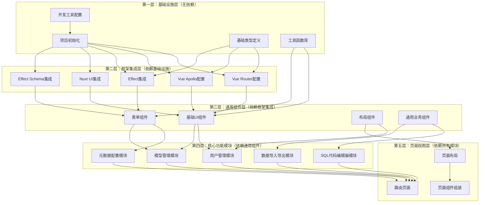
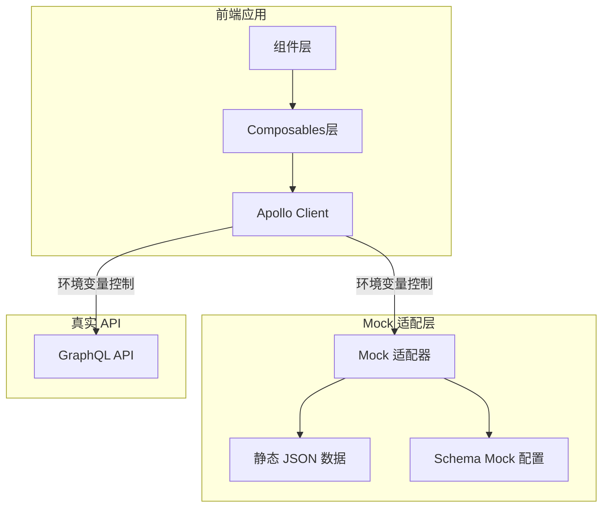

# 前端项目开发计划

## 模块依赖关系



## 开发顺序

### 第一阶段：基础设施层（无依赖）

#### 1.1 项目初始化
- [ ] 使用 Vite 创建 Vue 3 + TypeScript 项目
- [ ] 配置 pnpm 作为包管理器
- [ ] 配置项目基础结构（目录、文件）
- [ ] 配置环境变量（.env文件）

**文件结构：**
```
frontend/
├── src/
│   ├── main.ts
│   ├── App.vue
│   ├── assets/
│   ├── types/
│   ├── utils/
│   ├── composables/
│   ├── components/
│   ├── views/
│   ├── router/
│   ├── stores/
│   └── mocks/
│       ├── data/
│       ├── handlers.ts
│       ├── schema.ts
│       └── index.ts
├── public/
├── .env
├── .env.example
├── package.json
├── pnpm-lock.yaml
├── tsconfig.json
├── vite.config.ts
└── index.html
```

**验收方法：**
- [ ] **功能验收**
  - [ ] 项目能够成功启动（`pnpm dev`）
  - [ ] 项目能够成功构建（`pnpm build`）
  - [ ] 环境变量配置正确（`.env` 文件存在且格式正确）
  - [ ] 项目目录结构符合规范
- [ ] **开发工具验收**
  - [ ] TypeScript 编译无错误
  - [ ] ESLint 检查通过
  - [ ] Prettier 格式化正常
  - [ ] Git hooks 正常工作（如已配置）

#### 1.2 开发工具配置
- [ ] 配置 ESLint（Vue 3 + TypeScript规则）
- [ ] 配置 Prettier（代码格式化）
- [ ] 配置 Husky（Git hooks）
- [ ] 配置 lint-staged（暂存文件检查）
- [ ] 配置 commitlint（提交信息规范）
- [ ] 配置 Vitest（测试框架）

**配置文件：**
- `.eslintrc.cjs`
- `.prettierrc`
- `.prettierignore`
- `.husky/` 目录
- `commitlint.config.js`
- `vitest.config.ts`

**验收方法：**
- [ ] **功能验收**
  - [ ] ESLint 能够正确检查代码
  - [ ] Prettier 能够正确格式化代码
  - [ ] Husky Git hooks 能够正常触发
  - [ ] commitlint 能够验证提交信息
  - [ ] Vitest 能够运行测试
- [ ] **工具集成验收**
  - [ ] 保存文件时自动格式化（如配置了编辑器）
  - [ ] 提交代码前自动运行 lint（如配置了 Husky）
  - [ ] 代码检查规则符合 Vue 3 + TypeScript 规范

#### 1.3 基础类型定义
- [ ] 定义 GraphQL 相关类型
- [ ] 定义元数据相关类型
- [ ] 定义用户和权限相关类型
- [ ] 定义通用工具类型

**文件：**
- `src/types/graphql.ts`
- `src/types/metadata.ts`
- `src/types/user.ts`
- `src/types/common.ts`

**验收方法：**
- [ ] **功能验收**
  - [ ] 所有类型定义文件能够正确导入
  - [ ] TypeScript 类型检查通过
  - [ ] 类型定义覆盖主要业务场景
- [ ] **类型安全验收**
  - [ ] 类型定义与 GraphQL Schema 一致（如已有 Schema）
  - [ ] 类型定义支持类型推断
  - [ ] 无 `any` 类型（除非必要）

#### 1.4 工具函数库
- [ ] 封装 lodash-es 常用函数
- [ ] 日期处理工具（基于 dayjs）
- [ ] 文件处理工具
- [ ] 数据转换工具
- [ ] 验证工具

**文件：**
- `src/utils/lodash.ts`
- `src/utils/date.ts`
- `src/utils/file.ts`
- `src/utils/transform.ts`
- `src/utils/validate.ts`

**验收方法：**
- [ ] **功能验收**
  - [ ] 所有工具函数能够正确导入和使用
  - [ ] 工具函数有完整的 TypeScript 类型定义
  - [ ] 日期处理工具能够正确处理各种格式
  - [ ] 文件处理工具能够处理常见文件操作
  - [ ] 数据转换工具能够正确转换数据格式
  - [ ] 验证工具能够正确验证数据
- [ ] **代码质量验收**
  - [ ] 工具函数有清晰的文档注释
  - [ ] 工具函数遵循单一职责原则

### 第二阶段：框架集成层（依赖基础设施）

#### 2.1 Vue Router 配置
- [ ] 配置路由基础结构
- [ ] 定义路由类型
- [ ] 配置路由守卫（认证、权限）
- [ ] 配置路由懒加载

**文件：**
- `src/router/index.ts`
- `src/router/guards.ts`
- `src/router/types.ts`

**验收方法：**
- [ ] **功能验收**
  - [ ] 路由能够正确跳转
  - [ ] 路由懒加载正常工作
  - [ ] 路由守卫能够正确拦截未授权访问
  - [ ] 路由元信息能够正确读取
- [ ] **UI/UX 验收**
  - [ ] 路由切换有适当的过渡效果
  - [ ] 404 页面能够正确显示
  - [ ] 未授权访问能够正确重定向到登录页

#### 2.2 Vue Apollo 配置
- [ ] 配置 Apollo Client
- [ ] 配置 GraphQL 端点
- [ ] 配置认证头（Token）
- [ ] 配置错误处理
- [ ] 配置缓存策略

**文件：**
- `src/composables/graphql/apollo.ts`
- `src/composables/graphql/config.ts`
- `src/composables/graphql/mock.ts`
- `src/composables/graphql/adapter.ts`

**重要配置说明：**

⚠️ **必须使用 `@apollo/client/core` 导入路径**

在 Vue 项目中使用 Apollo Client 时，必须使用 `@apollo/client/core` 而不是 `@apollo/client`，以避免导入 React 相关依赖。

**正确的导入方式：**
```typescript
// ✅ 正确：使用 @apollo/client/core
import { ApolloClient, InMemoryCache, createHttpLink, from } from '@apollo/client/core'
import type { ApolloClientOptions, NormalizedCacheObject } from '@apollo/client/core'

// ❌ 错误：使用 @apollo/client 会导入 React 依赖
import { ApolloClient, InMemoryCache } from '@apollo/client'
```

**Link 相关导入保持不变：**
```typescript
// Link 相关的导入路径不需要改变
import { setContext } from '@apollo/client/link/context'
import { onError } from '@apollo/client/link/error'
```

**参考文档：**
- [Vue Apollo 官方文档 - Setup](https://apollo.vuejs.org/zh-cn/guide-option/setup.html)

**验收方法：**
- [ ] **功能验收**
  - [ ] Apollo Client 能够正确初始化
  - [ ] GraphQL 端点配置正确
  - [ ] 认证头能够正确添加到请求中
  - [ ] 错误处理能够正确捕获和显示
  - [ ] 缓存策略正常工作
  - [ ] Mock 接口能够正常工作（如启用）
  - [ ] 真实/假接口切换功能正常
- [ ] **集成验收**
  - [ ] 能够通过环境变量切换 Mock/真实接口
  - [ ] Mock 数据能够正确返回
  - [ ] 错误场景能够正确模拟（401、500 等）

#### 2.3 Effect 集成
- [ ] 创建 Effect composables 基础结构
- [ ] 封装 Effect 与 Vue 响应式系统的集成
- [ ] 实现 Effect 错误处理工具
- [ ] 实现 Effect 加载状态管理

**文件：**
- `src/composables/effects/base.ts`
- `src/composables/effects/reactive.ts`
- `src/composables/effects/error.ts`
- `src/composables/effects/loading.ts`

**验收方法：**
- [ ] **功能验收**
  - [ ] Effect composables 能够正确创建和使用
  - [ ] Effect 与 Vue 响应式系统集成正常
  - [ ] 错误处理能够正确捕获和显示
  - [ ] 加载状态能够正确管理
- [ ] **集成验收**
  - [ ] Effect 能够与 Apollo Client 正确集成
  - [ ] Effect 错误处理不影响 Vue 组件渲染

#### 2.4 Nuxt UI 集成
- [ ] 安装和配置 Nuxt UI
- [ ] 配置 Tailwind CSS
- [ ] 配置主题和样式变量
- [ ] 创建组件别名和快捷方式

**文件：**
- `src/composables/ui/config.ts`
- `tailwind.config.js`
- `nuxt.config.ts`（如果使用 Nuxt）或自定义配置

**验收方法：**
- [ ] **功能验收**
  - [ ] Nuxt UI 组件能够正确导入和使用
  - [ ] Tailwind CSS 样式能够正确应用
  - [ ] 主题配置能够正确生效
  - [ ] 组件别名和快捷方式能够正常使用
- [ ] **UI/UX 验收**
  - [ ] 组件样式符合设计规范
  - [ ] 响应式布局正常工作
  - [ ] 主题切换功能正常（如配置）

#### 2.5 Effect Schema 集成
- [ ] 配置 Effect Schema
- [ ] 创建表单验证 composable
- [ ] 实现数据转换工具（基于 Schema）
- [ ] 实现元数据到 Schema 的转换

**文件：**
- `src/composables/validation/schema.ts`
- `src/composables/validation/form.ts`
- `src/utils/schema-transform.ts`

**验收方法：**
- [ ] **功能验收**
  - [ ] Effect Schema 能够正确验证数据
  - [ ] 表单验证 composable 能够正确使用
  - [ ] 数据转换工具能够正确转换数据
  - [ ] 元数据到 Schema 的转换功能正常
- [ ] **集成验收**
  - [ ] Schema 验证能够与表单组件正确集成
  - [ ] 验证错误能够正确显示

### 第三阶段：通用组件层（依赖框架集成）

#### 3.1 基础 UI 组件
- [ ] 封装 Nuxt UI 组件（统一接口）
- [ ] 创建加载组件
- [ ] 创建错误提示组件
- [ ] 创建空状态组件
- [ ] 创建确认对话框组件

**文件：**
- `src/components/ui/` 目录
- `src/components/common/Loading.vue`
- `src/components/common/Error.vue`
- `src/components/common/Empty.vue`
- `src/components/common/ConfirmDialog.vue`

**验收方法：**
- [ ] **功能验收**
  - [ ] 所有基础 UI 组件能够正确渲染
  - [ ] 组件 props 和 events 能够正确传递
  - [ ] 加载组件能够正确显示加载状态
  - [ ] 错误提示组件能够正确显示错误信息
  - [ ] 空状态组件能够正确显示
  - [ ] 确认对话框能够正确显示和交互
- [ ] **UI/UX 验收**
  - [ ] 组件样式美观、一致
  - [ ] 组件交互流畅
  - [ ] 组件在不同屏幕尺寸下显示正常
  - [ ] 组件支持主题切换（如配置）

#### 3.2 表单组件
- [ ] 基于 Effect Schema 的动态表单组件
- [ ] 各种字段类型组件（文本、数字、日期、选择等）
- [ ] 表单验证显示组件
- [ ] 表单布局组件

**文件：**
- `src/components/form/DynamicForm.vue`
- `src/components/form/fields/` 目录
- `src/components/form/FormField.vue`
- `src/components/form/FormLayout.vue`

**验收方法：**
- [ ] **功能验收**
  - [ ] 动态表单能够根据 Schema 正确渲染
  - [ ] 各种字段类型组件能够正确显示和交互
  - [ ] 表单验证能够正确触发和显示
  - [ ] 表单布局组件能够正确排列字段
  - [ ] 表单数据能够正确收集和提交
- [ ] **UI/UX 验收**
  - [ ] 表单字段标签和提示清晰
  - [ ] 验证错误信息显示明确
  - [ ] 表单交互流畅
  - [ ] 表单在不同屏幕尺寸下显示正常
- [ ] **集成验收**
  - [ ] 表单能够与 Effect Schema 正确集成
  - [ ] 表单能够与 GraphQL Mutation 正确集成

#### 3.3 布局组件
- [ ] 主布局组件
- [ ] 侧边栏组件
- [ ] 顶部导航组件
- [ ] 面包屑组件
- [ ] 页脚组件

**文件：**
- `src/components/layout/MainLayout.vue`
- `src/components/layout/Sidebar.vue`
- `src/components/layout/Header.vue`
- `src/components/layout/Breadcrumb.vue`
- `src/components/layout/Footer.vue`

**验收方法：**
- [ ] **功能验收**
  - [ ] 主布局能够正确包裹页面内容
  - [ ] 侧边栏能够正确显示和折叠
  - [ ] 顶部导航能够正确显示用户信息和菜单
  - [ ] 面包屑能够正确显示当前路径
  - [ ] 页脚能够正确显示
- [ ] **UI/UX 验收**
  - [ ] 布局在不同屏幕尺寸下自适应
  - [ ] 侧边栏折叠/展开动画流畅
  - [ ] 导航菜单交互流畅
  - [ ] 布局样式美观、一致
- [ ] **响应式验收**
  - [ ] 移动端布局正常显示
  - [ ] 平板端布局正常显示
  - [ ] 桌面端布局正常显示

#### 3.4 通用业务组件
- [ ] 数据表格组件（支持排序、分页、筛选）
- [ ] 数据详情组件（动态渲染）
- [ ] 搜索组件
- [ ] 筛选组件

**文件：**
- `src/components/business/DataTable.vue`
- `src/components/business/DataDetail.vue`
- `src/components/business/SearchBar.vue`
- `src/components/business/FilterPanel.vue`

**验收方法：**
- [ ] **功能验收**
  - [ ] 数据表格能够正确显示数据
  - [ ] 排序功能正常工作
  - [ ] 分页功能正常工作
  - [ ] 筛选功能正常工作
  - [ ] 数据详情组件能够正确渲染
  - [ ] 搜索组件能够正确搜索
  - [ ] 筛选面板能够正确筛选数据
- [ ] **UI/UX 验收**
  - [ ] 表格样式美观、易读
  - [ ] 交互操作流畅
  - [ ] 加载状态正确显示
  - [ ] 空状态正确显示
- [ ] **集成验收**
  - [ ] 组件能够与 GraphQL Query 正确集成
  - [ ] 组件能够与 Mock 数据正确集成

### 第四阶段：核心功能模块（依赖通用组件）

#### 4.1 用户管理模块
- [ ] 登录页面
- [ ] 注册页面（如需要）
- [ ] 用户信息管理页面
- [ ] 角色管理页面
- [ ] 权限管理页面
- [ ] 认证 composable
- [ ] 权限检查 composable

**文件：**
- `src/views/auth/Login.vue`
- `src/views/user/UserList.vue`
- `src/views/user/UserDetail.vue`
- `src/views/role/RoleList.vue`
- `src/composables/auth/useAuth.ts`
- `src/composables/auth/usePermission.ts`
- `src/composables/graphql/queries/user.ts`
- `src/composables/graphql/mutations/user.ts`

**验收方法：**
- [ ] **功能验收**
  - [ ] 登录页面能够正确显示和提交
  - [ ] 登录功能能够正确验证用户（使用 Mock 数据）
  - [ ] 用户列表页面能够正确显示用户列表
  - [ ] 用户详情页面能够正确显示用户信息
  - [ ] 角色管理页面能够正确管理角色
  - [ ] 认证 composable 能够正确管理登录状态
  - [ ] 权限检查 composable 能够正确检查权限
- [ ] **UI/UX 验收**
  - [ ] 登录表单交互流畅
  - [ ] 用户列表操作便捷
  - [ ] 错误提示清晰明确
- [ ] **错误处理验收**
  - [ ] 登录失败能够正确显示错误信息
  - [ ] 未授权访问能够正确拦截
  - [ ] 权限不足能够正确提示
- [ ] **Mock 数据验收**
  - [ ] 能够使用 Mock 数据完成登录流程
  - [ ] 能够使用 Mock 数据查看用户列表
  - [ ] Mock 数据符合业务逻辑

#### 4.2 模型管理模块
- [ ] 模型列表页面
- [ ] 模型创建/编辑页面
- [ ] 模型详情页面
- [ ] 字段管理组件
- [ ] 模型关系配置组件
- [ ] 模型管理 composable

**文件：**
- `src/views/model/ModelList.vue`
- `src/views/model/ModelForm.vue`
- `src/views/model/ModelDetail.vue`
- `src/components/model/FieldManager.vue`
- `src/components/model/RelationConfig.vue`
- `src/composables/model/useModel.ts`
- `src/composables/graphql/queries/model.ts`
- `src/composables/graphql/mutations/model.ts`

**验收方法：**
- [ ] **功能验收**
  - [ ] 模型列表页面能够正确显示模型列表
  - [ ] 模型创建/编辑页面能够正确创建和编辑模型
  - [ ] 模型详情页面能够正确显示模型信息
  - [ ] 字段管理组件能够正确管理字段
  - [ ] 模型关系配置组件能够正确配置关系
  - [ ] 模型管理 composable 能够正确管理模型
- [ ] **UI/UX 验收**
  - [ ] 模型表单交互流畅
  - [ ] 字段管理操作便捷
  - [ ] 关系配置界面清晰
- [ ] **错误处理验收**
  - [ ] 模型创建失败能够正确显示错误
  - [ ] 字段验证错误能够正确显示
- [ ] **Mock 数据验收**
  - [ ] 能够使用 Mock 数据完成模型 CRUD 操作
  - [ ] Mock 数据包含各种字段类型
  - [ ] Mock 数据包含模型关系

#### 4.3 元数据配置模块
- [ ] 元数据配置页面
- [ ] 字段类型配置组件
- [ ] 验证规则配置组件
- [ ] 页面展示配置组件
- [ ] 字段编辑规则配置组件
- [ ] 权限配置组件
- [ ] 元数据配置 composable

**文件：**
- `src/views/metadata/MetadataConfig.vue`
- `src/components/metadata/FieldTypeConfig.vue`
- `src/components/metadata/ValidationConfig.vue`
- `src/components/metadata/DisplayConfig.vue`
- `src/components/metadata/EditRuleConfig.vue`
- `src/components/metadata/PermissionConfig.vue`
- `src/composables/metadata/useMetadata.ts`
- `src/composables/graphql/queries/metadata.ts`
- `src/composables/graphql/mutations/metadata.ts`

**验收方法：**
- [ ] **功能验收**
  - [ ] 元数据配置页面能够正确显示和编辑配置
  - [ ] 字段类型配置组件能够正确配置类型
  - [ ] 验证规则配置组件能够正确配置验证规则
  - [ ] 页面展示配置组件能够正确配置展示规则
  - [ ] 字段编辑规则配置组件能够正确配置编辑规则
  - [ ] 权限配置组件能够正确配置权限
  - [ ] 元数据配置 composable 能够正确管理配置
- [ ] **UI/UX 验收**
  - [ ] 配置界面清晰易用
  - [ ] 配置项分组合理
  - [ ] 配置预览功能正常
- [ ] **Mock 数据验收**
  - [ ] 能够使用 Mock 数据完成元数据配置
  - [ ] Mock 数据包含各种配置场景

#### 4.4 SQL 代码编辑器模块
- [ ] SQL 编辑器组件（Monaco Editor）
- [ ] SQL 执行结果展示组件
- [ ] SQL 代码管理页面
- [ ] SQL 历史记录组件
- [ ] SQL 编辑器 composable

**文件：**
- `src/components/sql/SqlEditor.vue`
- `src/components/sql/SqlResult.vue`
- `src/views/sql/SqlList.vue`
- `src/views/sql/SqlEditor.vue`
- `src/components/sql/SqlHistory.vue`
- `src/composables/sql/useSqlEditor.ts`
- `src/composables/graphql/queries/sql.ts`
- `src/composables/graphql/mutations/sql.ts`

**验收方法：**
- [ ] **功能验收**
  - [ ] SQL 编辑器能够正确显示和编辑 SQL 代码
  - [ ] SQL 编辑器支持语法高亮
  - [ ] SQL 执行结果能够正确显示
  - [ ] SQL 代码管理页面能够正确管理代码
  - [ ] SQL 历史记录能够正确显示
  - [ ] SQL 编辑器 composable 能够正确管理编辑器状态
- [ ] **UI/UX 验收**
  - [ ] 编辑器交互流畅
  - [ ] 代码提示功能正常
  - [ ] 执行结果展示清晰
- [ ] **错误处理验收**
  - [ ] SQL 执行错误能够正确显示
  - [ ] 语法错误能够正确提示
- [ ] **Mock 数据验收**
  - [ ] 能够使用 Mock 数据模拟 SQL 执行
  - [ ] Mock 数据包含各种 SQL 执行结果场景

#### 4.5 数据导入导出模块
- [ ] 数据导入组件（支持 Excel、CSV、JSON）
- [ ] 数据导出组件
- [ ] 导入预览组件
- [ ] 导入结果展示组件
- [ ] 数据导入导出 composable

**文件：**
- `src/components/import-export/DataImport.vue`
- `src/components/import-export/DataExport.vue`
- `src/components/import-export/ImportPreview.vue`
- `src/components/import-export/ImportResult.vue`
- `src/composables/import-export/useImportExport.ts`
- `src/utils/excel.ts`（基于 xlsx）

**验收方法：**
- [ ] **功能验收**
  - [ ] 数据导入组件能够正确导入 Excel、CSV、JSON 文件
  - [ ] 数据导出组件能够正确导出数据
  - [ ] 导入预览组件能够正确预览导入数据
  - [ ] 导入结果组件能够正确显示导入结果
  - [ ] 数据导入导出 composable 能够正确管理导入导出流程
- [ ] **UI/UX 验收**
  - [ ] 文件上传交互流畅
  - [ ] 预览界面清晰
  - [ ] 进度提示明确
- [ ] **错误处理验收**
  - [ ] 文件格式错误能够正确提示
  - [ ] 数据验证错误能够正确显示
  - [ ] 导入失败能够正确提示
- [ ] **Mock 数据验收**
  - [ ] 能够使用 Mock 数据模拟导入导出流程
  - [ ] Mock 数据包含各种文件格式场景

### 第五阶段：页面视图层（依赖所有模块）

#### 5.1 路由页面
- [ ] 配置所有业务路由
- [ ] 创建页面入口组件
- [ ] 配置路由元信息（权限、标题等）

**文件：**
- `src/router/routes.ts`
- `src/views/` 目录下的所有页面

**验收方法：**
- [ ] **功能验收**
  - [ ] 所有业务路由能够正确配置
  - [ ] 页面入口组件能够正确渲染
  - [ ] 路由元信息能够正确读取和使用
  - [ ] 路由权限控制正常工作
- [ ] **集成验收**
  - [ ] 所有页面能够正确访问
  - [ ] 页面间导航正常
  - [ ] 路由守卫正常工作

#### 5.2 页面布局
- [ ] 整合布局组件
- [ ] 配置响应式布局
- [ ] 配置主题切换（如需要）

**文件：**
- `src/views/layouts/` 目录

**验收方法：**
- [ ] **功能验收**
  - [ ] 布局组件能够正确整合
  - [ ] 响应式布局正常工作
  - [ ] 主题切换功能正常（如配置）
- [ ] **UI/UX 验收**
  - [ ] 布局在不同设备上显示正常
  - [ ] 布局样式美观、一致

#### 5.3 页面组件组装
- [ ] 组装各个功能模块到页面
- [ ] 实现页面间导航
- [ ] 实现页面状态管理

**文件：**
- 各个页面视图文件

**验收方法：**
- [ ] **功能验收**
  - [ ] 各个功能模块能够正确组装到页面
  - [ ] 页面间导航正常
  - [ ] 页面状态管理正常
- [ ] **集成验收**
  - [ ] 所有模块能够正确集成
  - [ ] 页面交互流畅
  - [ ] 数据流正常
- [ ] **端到端验收**
  - [ ] 完整业务流程能够正常完成
  - [ ] 用户能够完成主要操作
  - [ ] 系统整体运行稳定

## 开发注意事项

### 技术栈使用规范

1. **Vue 3 Composition API**
   - 优先使用 `<script setup>` 语法
   - 使用 `ref` 和 `reactive` 管理响应式状态
   - 使用 `computed` 实现计算属性
   - 使用 `watch` 和 `watchEffect` 处理副作用

2. **Effect 库**
   - 使用 Effect 处理所有异步操作
   - 使用 Effect Schema 进行数据验证
   - 在 composables 中集成 Effect
   - 使用 Effect 的错误处理机制

3. **GraphQL (Vue Apollo)**
   - ⚠️ **必须使用 `@apollo/client/core` 导入路径**，避免导入 React 依赖
   - 使用 `useQuery`、`useMutation` 等 composables
   - 使用 fragments 实现可复用的查询部分
   - 实现适当的错误处理和加载状态
   - 利用 Apollo Client 的缓存能力
   - 参考 [Vue Apollo 官方文档](https://apollo.vuejs.org/zh-cn/guide-option/setup.html)

4. **Nuxt UI**
   - 参考 Nuxt UI 文档（通过 MCP 查询）
   - 保持组件风格一致
   - 充分利用 Tailwind CSS 工具类

5. **TypeScript**
   - 所有代码必须使用 TypeScript
   - 定义清晰的类型接口
   - 使用类型推断减少冗余代码

### 代码组织规范

1. **Composables 组织**
   - GraphQL 相关：`src/composables/graphql/`
   - Effect 相关：`src/composables/effects/`
   - 业务相关：`src/composables/{module}/`

2. **组件组织**
   - UI 组件：`src/components/ui/`
   - 业务组件：`src/components/{module}/`
   - 通用组件：`src/components/common/`

3. **类型定义**
   - GraphQL 类型：`src/types/graphql.ts`
   - 业务类型：`src/types/{module}.ts`
   - 通用类型：`src/types/common.ts`

## 开发里程碑

- **里程碑 1**：✅ 完成基础设施层和框架集成层（阶段一、二）- **已完成并验收通过**
- **里程碑 2**：完成通用组件层（阶段三）
- **里程碑 3**：完成用户管理和模型管理模块（阶段四部分）
- **里程碑 4**：完成元数据配置模块（阶段四部分）
- **里程碑 5**：完成 SQL 编辑器和数据导入导出模块（阶段四部分）
- **里程碑 6**：完成页面视图层整合（阶段五）

## 假接口实现方案

### 架构设计



### 实现方式

使用 **Apollo Client Mock** + **静态 JSON 文件** 的方式实现假接口：

1. **Apollo Client Mock 配置**
   - 使用 `@apollo/client/testing` 的 `MockedProvider`
   - 配置 Mock 响应和延迟
   - 支持 GraphQL 查询和变更的 Mock

2. **静态 JSON 数据文件**
   - 按模块组织 Mock 数据文件（如 `user.json`, `model.json`）
   - 存储在 `src/mocks/data/` 目录
   - 使用 TypeScript 类型确保 Mock 数据与真实接口类型一致

3. **Mock Handlers**
   - 在 `src/mocks/handlers.ts` 中定义 Mock 处理逻辑
   - 将静态 JSON 数据映射到 GraphQL 查询/变更
   - 支持分页、筛选等复杂场景

### 文件结构

```
frontend/src/
├── mocks/
│   ├── data/
│   │   ├── user.json          # 用户相关 Mock 数据
│   │   ├── model.json          # 模型相关 Mock 数据
│   │   ├── metadata.json      # 元数据相关 Mock 数据
│   │   ├── sql.json           # SQL 相关 Mock 数据
│   │   └── import-export.json  # 导入导出相关 Mock 数据
│   ├── handlers.ts             # Apollo Mock Handlers
│   ├── schema.ts               # GraphQL Schema 定义（用于 Mock）
│   └── index.ts                # Mock 配置入口
├── composables/
│   └── graphql/
│       ├── apollo.ts           # Apollo Client 配置
│       ├── mock.ts             # Mock 适配器
│       └── adapter.ts          # 接口适配器（切换真实/假接口）
```

### 环境变量配置

在 `.env` 和 `.env.example` 中添加：

```env
# 是否使用 Mock 接口
VITE_USE_MOCK=true

# GraphQL API 端点（真实接口）
VITE_GRAPHQL_ENDPOINT=http://localhost:5000/graphql

# Mock 响应延迟（毫秒，模拟网络延迟）
VITE_MOCK_DELAY=300
```

### 技术实现要点

1. **Apollo Client Mock 配置**
   - 使用 `MockedProvider` 包装 Apollo Client
   - 根据环境变量 `VITE_USE_MOCK` 决定使用 Mock 还是真实接口
   - 配置 Mock 响应延迟以模拟真实网络环境

2. **类型安全**
   - Mock 数据使用与真实接口相同的 TypeScript 类型
   - 确保切换真实接口时类型兼容
   - 使用 GraphQL Code Generator 生成类型定义

3. **开发体验**
   - Mock 响应可配置延迟（模拟网络延迟）
   - 支持错误场景的 Mock（如 401、500 等）
   - 提供 Mock 数据管理工具函数

## 接口切换机制

### 切换原理

通过环境变量和适配器层实现真实/假接口的无缝切换：

1. **环境变量控制**
   - 开发时：`VITE_USE_MOCK=true`（使用 Mock）
   - 对接真实后端：`VITE_USE_MOCK=false`（使用真实接口）

2. **适配器层**
   - 在 `src/composables/graphql/adapter.ts` 中实现接口适配器
   - 根据环境变量自动选择使用 Mock 或真实接口
   - 业务代码无需修改，只需修改环境变量

### 实现方式

```typescript
// src/composables/graphql/adapter.ts
export function createApolloClient() {
  const useMock = import.meta.env.VITE_USE_MOCK === 'true';
  
  if (useMock) {
    return createMockApolloClient();
  } else {
    return createRealApolloClient();
  }
}
```

### 切换步骤

1. **开发阶段（使用 Mock）**
   ```env
   VITE_USE_MOCK=true
   ```

2. **对接真实后端（使用真实接口）**
   ```env
   VITE_USE_MOCK=false
   VITE_GRAPHQL_ENDPOINT=http://localhost:5000/graphql
   ```

3. **无需修改业务代码**
   - 所有 GraphQL 查询和变更通过统一的 composables 调用
   - 适配器层自动处理接口切换
   - 类型定义保持一致

## Mock 数据组织规范

### 目录结构

```
src/mocks/
├── data/                    # Mock 数据文件目录
│   ├── user.json            # 用户相关数据
│   ├── model.json           # 模型相关数据
│   ├── metadata.json        # 元数据相关数据
│   ├── sql.json             # SQL 相关数据
│   └── import-export.json   # 导入导出相关数据
├── handlers.ts              # Mock 处理逻辑
├── schema.ts                # GraphQL Schema
└── index.ts                 # 入口文件
```

### 数据文件规范

1. **文件命名**
   - 按模块命名，使用小写字母和连字符
   - 例如：`user.json`, `model.json`, `metadata.json`

2. **数据结构**
   - 使用与真实接口相同的数据结构
   - 包含完整的字段信息
   - 支持分页数据结构（如 `{ data: [], total: 0, page: 1 }`）

3. **数据内容**
   - 包含多种场景的数据（成功、失败、空数据等）
   - 数据量适中，便于测试
   - 数据符合业务逻辑

### Mock 数据示例

```json
// src/mocks/data/user.json
{
  "users": [
    {
      "id": "1",
      "username": "admin",
      "email": "admin@example.com",
      "role": "admin",
      "createdAt": "2024-01-01T00:00:00Z"
    },
    {
      "id": "2",
      "username": "user1",
      "email": "user1@example.com",
      "role": "user",
      "createdAt": "2024-01-02T00:00:00Z"
    }
  ],
  "pagination": {
    "page": 1,
    "pageSize": 10,
    "total": 2
  }
}
```

### Mock Handlers 规范

1. **Handler 结构**
   - 每个 GraphQL 操作对应一个 Mock Handler
   - Handler 返回符合 GraphQL 响应格式的数据
   - 支持变量匹配和条件返回

2. **错误场景 Mock**
   - 支持模拟各种错误场景（401、403、500 等）
   - 通过配置控制返回错误或成功
   - 便于测试错误处理逻辑

3. **延迟配置**
   - 支持配置响应延迟
   - 模拟真实网络环境
   - 便于测试加载状态

### 类型安全

1. **类型定义**
   - Mock 数据使用与真实接口相同的 TypeScript 类型
   - 使用 GraphQL Code Generator 生成类型
   - 确保类型一致性

2. **类型检查**
   - 在构建时检查 Mock 数据是否符合类型定义
   - 使用 TypeScript 严格模式
   - 确保类型安全

## 下一步行动

1. 确认开发计划
2. 开始第一阶段开发：项目初始化
3. 逐步推进各阶段开发
4. 在第二阶段配置 Mock 接口系统

