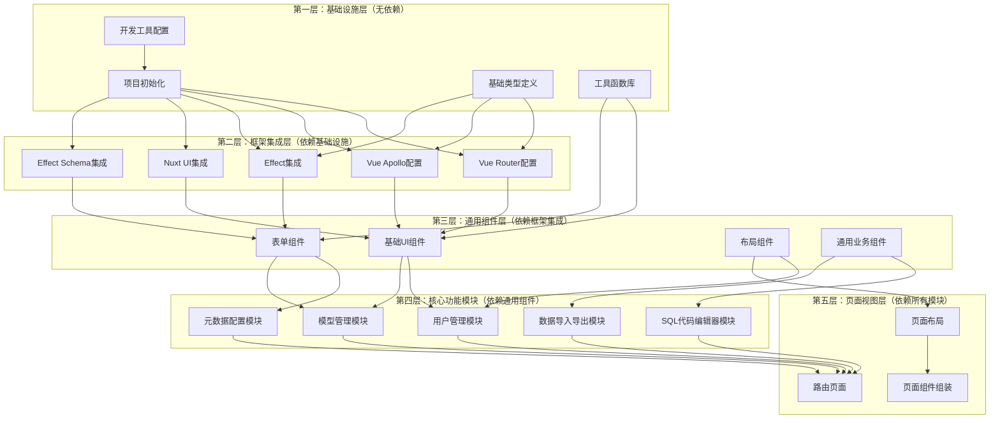

# 前端项目开发计划

## 模块依赖关系



## 开发顺序

### 第一阶段：基础设施层（无依赖）

#### 1.1 项目初始化
- [ ] 使用 Vite 创建 Vue 3 + TypeScript 项目
- [ ] 配置 pnpm 作为包管理器
- [ ] 配置项目基础结构（目录、文件）
- [ ] 配置环境变量（.env文件）

**文件结构：**
```
frontend/
├── src/
│   ├── main.ts
│   ├── App.vue
│   ├── assets/
│   ├── types/
│   ├── utils/
│   ├── composables/
│   ├── components/
│   ├── views/
│   ├── router/
│   └── stores/
├── public/
├── .env
├── .env.example
├── package.json
├── pnpm-lock.yaml
├── tsconfig.json
├── vite.config.ts
└── index.html
```

#### 1.2 开发工具配置
- [ ] 配置 ESLint（Vue 3 + TypeScript规则）
- [ ] 配置 Prettier（代码格式化）
- [ ] 配置 Husky（Git hooks）
- [ ] 配置 lint-staged（暂存文件检查）
- [ ] 配置 commitlint（提交信息规范）
- [ ] 配置 Vitest（测试框架）

**配置文件：**
- `.eslintrc.cjs`
- `.prettierrc`
- `.prettierignore`
- `.husky/` 目录
- `commitlint.config.js`
- `vitest.config.ts`

#### 1.3 基础类型定义
- [ ] 定义 GraphQL 相关类型
- [ ] 定义元数据相关类型
- [ ] 定义用户和权限相关类型
- [ ] 定义通用工具类型

**文件：**
- `src/types/graphql.ts`
- `src/types/metadata.ts`
- `src/types/user.ts`
- `src/types/common.ts`

#### 1.4 工具函数库
- [ ] 封装 lodash-es 常用函数
- [ ] 日期处理工具（基于 dayjs）
- [ ] 文件处理工具
- [ ] 数据转换工具
- [ ] 验证工具

**文件：**
- `src/utils/lodash.ts`
- `src/utils/date.ts`
- `src/utils/file.ts`
- `src/utils/transform.ts`
- `src/utils/validate.ts`

### 第二阶段：框架集成层（依赖基础设施）

#### 2.1 Vue Router 配置
- [ ] 配置路由基础结构
- [ ] 定义路由类型
- [ ] 配置路由守卫（认证、权限）
- [ ] 配置路由懒加载

**文件：**
- `src/router/index.ts`
- `src/router/guards.ts`
- `src/router/types.ts`

#### 2.2 Vue Apollo 配置
- [ ] 配置 Apollo Client
- [ ] 配置 GraphQL 端点
- [ ] 配置认证头（Token）
- [ ] 配置错误处理
- [ ] 配置缓存策略

**文件：**
- `src/composables/graphql/apollo.ts`
- `src/composables/graphql/config.ts`

#### 2.3 Effect 集成
- [ ] 创建 Effect composables 基础结构
- [ ] 封装 Effect 与 Vue 响应式系统的集成
- [ ] 实现 Effect 错误处理工具
- [ ] 实现 Effect 加载状态管理

**文件：**
- `src/composables/effects/base.ts`
- `src/composables/effects/reactive.ts`
- `src/composables/effects/error.ts`
- `src/composables/effects/loading.ts`

#### 2.4 Nuxt UI 集成
- [ ] 安装和配置 Nuxt UI
- [ ] 配置 Tailwind CSS
- [ ] 配置主题和样式变量
- [ ] 创建组件别名和快捷方式

**文件：**
- `src/composables/ui/config.ts`
- `tailwind.config.js`
- `nuxt.config.ts`（如果使用 Nuxt）或自定义配置

#### 2.5 Effect Schema 集成
- [ ] 配置 Effect Schema
- [ ] 创建表单验证 composable
- [ ] 实现数据转换工具（基于 Schema）
- [ ] 实现元数据到 Schema 的转换

**文件：**
- `src/composables/validation/schema.ts`
- `src/composables/validation/form.ts`
- `src/utils/schema-transform.ts`

### 第三阶段：通用组件层（依赖框架集成）

#### 3.1 基础 UI 组件
- [ ] 封装 Nuxt UI 组件（统一接口）
- [ ] 创建加载组件
- [ ] 创建错误提示组件
- [ ] 创建空状态组件
- [ ] 创建确认对话框组件

**文件：**
- `src/components/ui/` 目录
- `src/components/common/Loading.vue`
- `src/components/common/Error.vue`
- `src/components/common/Empty.vue`
- `src/components/common/ConfirmDialog.vue`

#### 3.2 表单组件
- [ ] 基于 Effect Schema 的动态表单组件
- [ ] 各种字段类型组件（文本、数字、日期、选择等）
- [ ] 表单验证显示组件
- [ ] 表单布局组件

**文件：**
- `src/components/form/DynamicForm.vue`
- `src/components/form/fields/` 目录
- `src/components/form/FormField.vue`
- `src/components/form/FormLayout.vue`

#### 3.3 布局组件
- [ ] 主布局组件
- [ ] 侧边栏组件
- [ ] 顶部导航组件
- [ ] 面包屑组件
- [ ] 页脚组件

**文件：**
- `src/components/layout/MainLayout.vue`
- `src/components/layout/Sidebar.vue`
- `src/components/layout/Header.vue`
- `src/components/layout/Breadcrumb.vue`
- `src/components/layout/Footer.vue`

#### 3.4 通用业务组件
- [ ] 数据表格组件（支持排序、分页、筛选）
- [ ] 数据详情组件（动态渲染）
- [ ] 搜索组件
- [ ] 筛选组件

**文件：**
- `src/components/business/DataTable.vue`
- `src/components/business/DataDetail.vue`
- `src/components/business/SearchBar.vue`
- `src/components/business/FilterPanel.vue`

### 第四阶段：核心功能模块（依赖通用组件）

#### 4.1 用户管理模块
- [ ] 登录页面
- [ ] 注册页面（如需要）
- [ ] 用户信息管理页面
- [ ] 角色管理页面
- [ ] 权限管理页面
- [ ] 认证 composable
- [ ] 权限检查 composable

**文件：**
- `src/views/auth/Login.vue`
- `src/views/user/UserList.vue`
- `src/views/user/UserDetail.vue`
- `src/views/role/RoleList.vue`
- `src/composables/auth/useAuth.ts`
- `src/composables/auth/usePermission.ts`
- `src/composables/graphql/queries/user.ts`
- `src/composables/graphql/mutations/user.ts`

#### 4.2 模型管理模块
- [ ] 模型列表页面
- [ ] 模型创建/编辑页面
- [ ] 模型详情页面
- [ ] 字段管理组件
- [ ] 模型关系配置组件
- [ ] 模型管理 composable

**文件：**
- `src/views/model/ModelList.vue`
- `src/views/model/ModelForm.vue`
- `src/views/model/ModelDetail.vue`
- `src/components/model/FieldManager.vue`
- `src/components/model/RelationConfig.vue`
- `src/composables/model/useModel.ts`
- `src/composables/graphql/queries/model.ts`
- `src/composables/graphql/mutations/model.ts`

#### 4.3 元数据配置模块
- [ ] 元数据配置页面
- [ ] 字段类型配置组件
- [ ] 验证规则配置组件
- [ ] 页面展示配置组件
- [ ] 字段编辑规则配置组件
- [ ] 权限配置组件
- [ ] 元数据配置 composable

**文件：**
- `src/views/metadata/MetadataConfig.vue`
- `src/components/metadata/FieldTypeConfig.vue`
- `src/components/metadata/ValidationConfig.vue`
- `src/components/metadata/DisplayConfig.vue`
- `src/components/metadata/EditRuleConfig.vue`
- `src/components/metadata/PermissionConfig.vue`
- `src/composables/metadata/useMetadata.ts`
- `src/composables/graphql/queries/metadata.ts`
- `src/composables/graphql/mutations/metadata.ts`

#### 4.4 SQL 代码编辑器模块
- [ ] SQL 编辑器组件（Monaco Editor）
- [ ] SQL 执行结果展示组件
- [ ] SQL 代码管理页面
- [ ] SQL 历史记录组件
- [ ] SQL 编辑器 composable

**文件：**
- `src/components/sql/SqlEditor.vue`
- `src/components/sql/SqlResult.vue`
- `src/views/sql/SqlList.vue`
- `src/views/sql/SqlEditor.vue`
- `src/components/sql/SqlHistory.vue`
- `src/composables/sql/useSqlEditor.ts`
- `src/composables/graphql/queries/sql.ts`
- `src/composables/graphql/mutations/sql.ts`

#### 4.5 数据导入导出模块
- [ ] 数据导入组件（支持 Excel、CSV、JSON）
- [ ] 数据导出组件
- [ ] 导入预览组件
- [ ] 导入结果展示组件
- [ ] 数据导入导出 composable

**文件：**
- `src/components/import-export/DataImport.vue`
- `src/components/import-export/DataExport.vue`
- `src/components/import-export/ImportPreview.vue`
- `src/components/import-export/ImportResult.vue`
- `src/composables/import-export/useImportExport.ts`
- `src/utils/excel.ts`（基于 xlsx）

### 第五阶段：页面视图层（依赖所有模块）

#### 5.1 路由页面
- [ ] 配置所有业务路由
- [ ] 创建页面入口组件
- [ ] 配置路由元信息（权限、标题等）

**文件：**
- `src/router/routes.ts`
- `src/views/` 目录下的所有页面

#### 5.2 页面布局
- [ ] 整合布局组件
- [ ] 配置响应式布局
- [ ] 配置主题切换（如需要）

**文件：**
- `src/views/layouts/` 目录

#### 5.3 页面组件组装
- [ ] 组装各个功能模块到页面
- [ ] 实现页面间导航
- [ ] 实现页面状态管理

**文件：**
- 各个页面视图文件

## 开发注意事项

### 技术栈使用规范

1. **Vue 3 Composition API**
   - 优先使用 `<script setup>` 语法
   - 使用 `ref` 和 `reactive` 管理响应式状态
   - 使用 `computed` 实现计算属性
   - 使用 `watch` 和 `watchEffect` 处理副作用

2. **Effect 库**
   - 使用 Effect 处理所有异步操作
   - 使用 Effect Schema 进行数据验证
   - 在 composables 中集成 Effect
   - 使用 Effect 的错误处理机制

3. **GraphQL (Vue Apollo)**
   - 使用 `useQuery`、`useMutation` 等 composables
   - 使用 fragments 实现可复用的查询部分
   - 实现适当的错误处理和加载状态
   - 利用 Apollo Client 的缓存能力

4. **Nuxt UI**
   - 参考 Nuxt UI 文档（通过 MCP 查询）
   - 保持组件风格一致
   - 充分利用 Tailwind CSS 工具类

5. **TypeScript**
   - 所有代码必须使用 TypeScript
   - 定义清晰的类型接口
   - 使用类型推断减少冗余代码

### 代码组织规范

1. **Composables 组织**
   - GraphQL 相关：`src/composables/graphql/`
   - Effect 相关：`src/composables/effects/`
   - 业务相关：`src/composables/{module}/`

2. **组件组织**
   - UI 组件：`src/components/ui/`
   - 业务组件：`src/components/{module}/`
   - 通用组件：`src/components/common/`

3. **类型定义**
   - GraphQL 类型：`src/types/graphql.ts`
   - 业务类型：`src/types/{module}.ts`
   - 通用类型：`src/types/common.ts`

## 开发里程碑

- **里程碑 1**：完成基础设施层和框架集成层（阶段一、二）
- **里程碑 2**：完成通用组件层（阶段三）
- **里程碑 3**：完成用户管理和模型管理模块（阶段四部分）
- **里程碑 4**：完成元数据配置模块（阶段四部分）
- **里程碑 5**：完成 SQL 编辑器和数据导入导出模块（阶段四部分）
- **里程碑 6**：完成页面视图层整合（阶段五）

## 下一步行动

1. 确认开发计划
2. 开始第一阶段开发：项目初始化
3. 逐步推进各阶段开发

