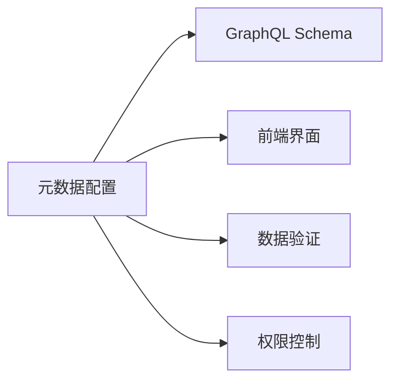
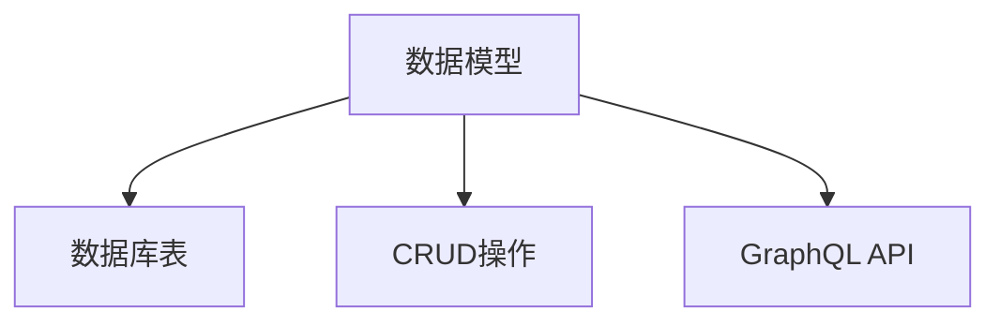
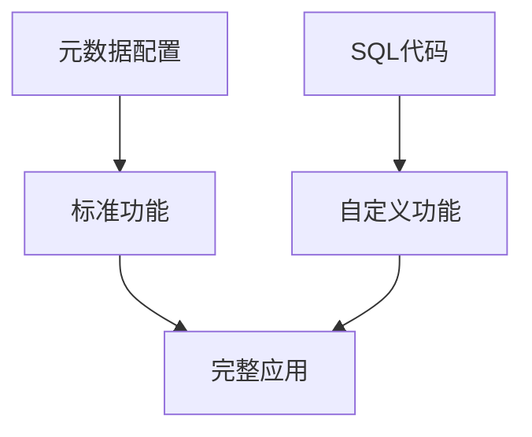
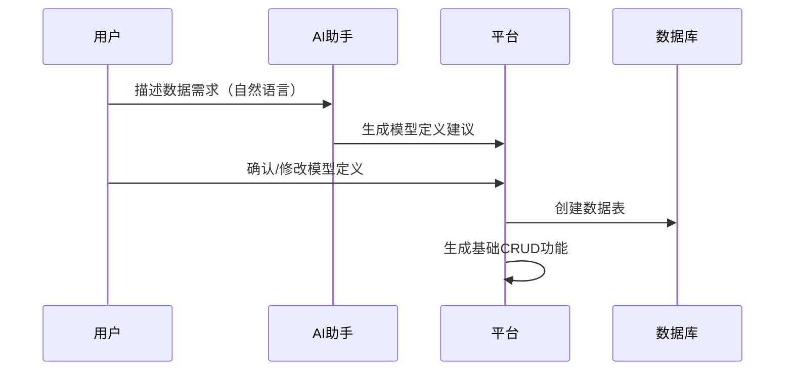
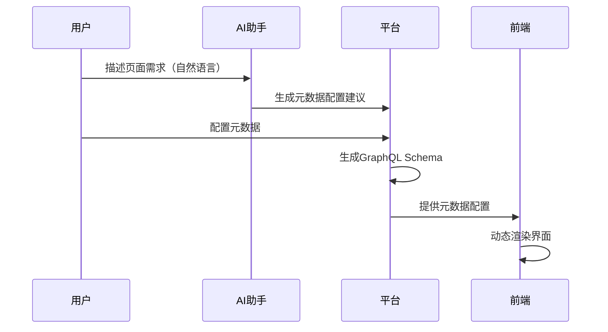
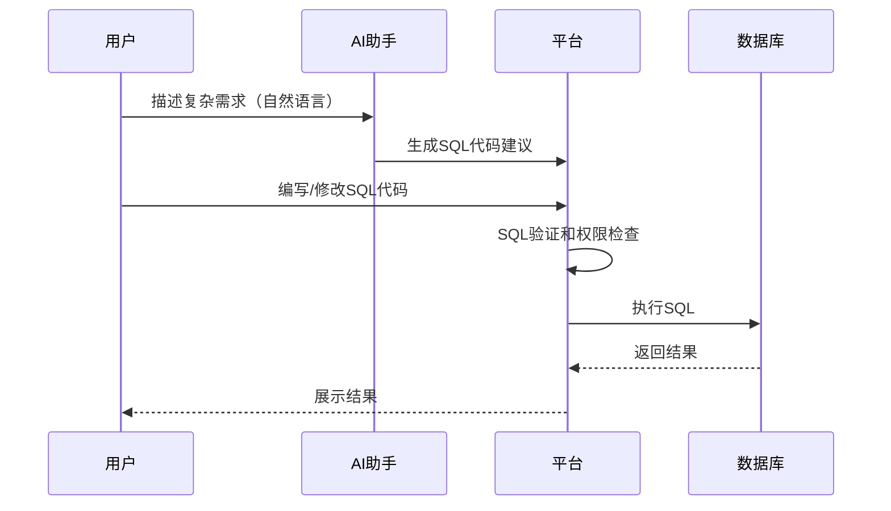
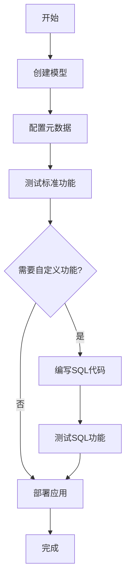

# 平台范式

## 概述

"如意"AI低代码平台采用**元数据驱动（Metadata-Driven）**的低代码开发范式，结合**模型驱动（Model-Driven）**和**代码扩展（Code Extension）**的混合模式，在保证开发效率的同时，为复杂场景提供了灵活的扩展能力。

## 核心概念

### 1. 模型（Model）

- **定义**：一个模型对应一个数据库表
- **作用**：定义数据结构，包括字段名称、类型、约束等
- **特点**：模型是平台的基础单元，所有功能都围绕模型展开

### 2. 元数据（Metadata）

- **定义**：描述模型如何展示、编辑、验证的配置信息
- **内容**：
  - 字段类型和验证规则
  - 页面展示配置（列表、详情、表单布局）
  - 字段编辑规则（可编辑性、默认值、联动规则）
  - 字段级权限控制
- **作用**：通过配置而非编码的方式定义应用行为

### 3. SQL代码扩展

- **定义**：用户编写的自定义SQL代码
- **场景**：
  - 复杂查询（报表、统计分析）
  - 数据处理和转换
  - 自定义业务逻辑（存储过程、触发器）
- **特点**：这是平台开发者唯一需要编写代码的地方

## 范式特点

### 元数据驱动（Metadata-Driven）

- **配置即应用**：通过元数据配置定义应用行为，无需编写大量代码
- **自动生成**：根据元数据自动生成GraphQL API和前端界面
- **灵活扩展**：元数据可以随时修改，应用行为随之改变

### 模型驱动（Model-Driven）

- **模型为中心**：以数据模型为中心，自动生成基础功能
- **表结构自动管理**：根据模型定义自动创建和更新数据库表
- **标准化操作**：自动生成标准的CRUD操作

### 代码扩展（Code Extension）

- **配置优先**：优先使用元数据配置实现功能
- **代码补充**：复杂场景通过SQL代码扩展
- **最佳实践**：80%的功能通过配置实现，20%的复杂功能通过代码实现

## 工作流程

### 1. 模型创建流程

**步骤说明**：

1. **需求描述**：用户用自然语言描述数据需求（可选，可使用AI辅助）
2. **模型定义**：创建模型，定义字段名称、类型、约束
3. **表结构创建**：平台自动创建对应的数据库表
4. **基础功能生成**：自动生成GraphQL API和基础CRUD操作

### 2. 元数据配置流程

**步骤说明**：

1. **配置字段类型**：定义字段的数据类型和验证规则
2. **配置页面展示**：配置列表页、详情页、表单的展示方式
3. **配置编辑规则**：设置字段的可编辑性、默认值、联动规则
4. **配置权限**：设置字段级权限控制
5. **自动生成**：平台根据元数据自动生成GraphQL Schema和前端界面

### 3. SQL代码扩展流程

**步骤说明**：

1. **需求分析**：识别无法通过元数据配置实现的复杂需求
2. **SQL编写**：在SQL编辑器中编写自定义SQL代码（可使用AI辅助）
3. **代码验证**：平台进行SQL语法检查和权限验证
4. **执行和测试**：在安全环境中执行SQL，验证结果
5. **保存和管理**：保存SQL代码，支持版本管理

### 4. 完整应用开发流程

## 范式优势

### 1. 开发效率

- **快速开发**：通过配置快速构建应用，无需编写大量代码
- **AI辅助**：AI帮助生成模型和元数据配置，进一步提升效率
- **标准化**：标准化的开发流程，降低学习成本

### 2. 灵活性

- **配置灵活**：元数据配置可以随时修改，应用行为随之改变
- **代码扩展**：复杂场景通过SQL代码扩展，不受配置限制
- **渐进增强**：从简单配置开始，逐步添加复杂功能

### 3. 可维护性

- **配置即文档**：元数据配置本身就是应用行为的文档
- **集中管理**：所有配置集中管理，便于维护和版本控制
- **代码最小化**：只有复杂功能需要代码，代码量最小化

### 4. 可扩展性

- **模型扩展**：可以随时添加新模型和字段
- **功能扩展**：通过SQL代码扩展复杂功能
- **权限扩展**：支持细粒度的权限控制

## 适用场景

### 适合的场景

- **数据管理应用**：需要快速构建数据管理界面
- **业务系统**：标准化的业务系统（CRM、ERP等）
- **报表系统**：需要灵活的数据查询和报表功能
- **原型开发**：快速验证业务想法

### 不适合的场景

- **高性能计算**：需要极致性能的场景
- **复杂算法**：需要复杂算法实现的场景
- **实时系统**：需要毫秒级响应的实时系统

## 与其他范式的对比

| 特性 | 元数据驱动 | 代码生成 | 可视化拖拽 |
|------|-----------|---------|-----------|
| 开发速度 | ⭐⭐⭐⭐⭐ | ⭐⭐⭐ | ⭐⭐⭐⭐ |
| 灵活性 | ⭐⭐⭐⭐ | ⭐⭐⭐⭐⭐ | ⭐⭐⭐ |
| 学习成本 | ⭐⭐⭐⭐ | ⭐⭐ | ⭐⭐⭐⭐ |
| 代码量 | 最少 | 多 | 中等 |
| 扩展性 | ⭐⭐⭐⭐ | ⭐⭐⭐⭐⭐ | ⭐⭐⭐ |

## 总结

元数据驱动范式通过"配置优先，代码补充"的方式，在开发效率和灵活性之间取得了良好的平衡。对于大多数业务应用，80%的功能可以通过元数据配置实现，20%的复杂功能通过SQL代码扩展，既保证了开发效率，又提供了足够的灵活性。

